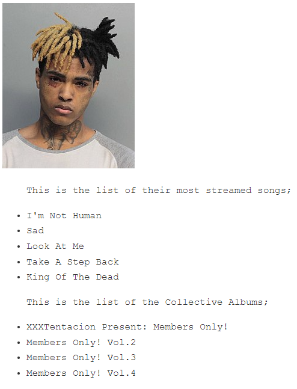
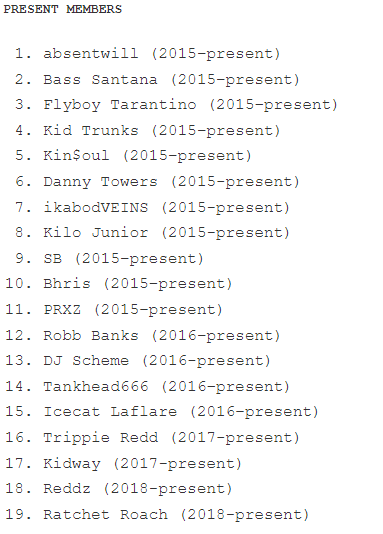

Independent Project #1 |
 #FavouriteBand Website


# {FAVOURITE BAND}
#### {Landing Page}, {August 2023}
#### By **{Roy Kimari}**
## Description
This is the landing page for my favourite band. The project is to test my understanding and skill in HTML and CSS up to now. I am to design the page providing the following necessary requirements;
* List of my favorite songs or albums.
* Add a list of their songs or album
* A short biography paragraph for each member of the band.
* An image of each of the band member alongside their biography.
* Links to their songs especially the ones that are my favorite. 
* An introductory paragraph of the band and why they are my favorite band
* Make the page as visually appealing as you can with the knowledge you have learnt so far
* 
| Albums | Present Members |
| ----------------------------------| --------------------------------------------------- |
|  |  |

* The main goal is to create a page that resembles the one provided.

## Pre-requisites
- Linux/Windows/MacOS
- At least 2GB RAM
- At least 3GB ROM
- Visual Studio Code
- GitHub Account
- Browser
## Setup/Installation Requirements
This is how to set up and run this code on your computer:

1. Open your browser on your computer and access your git hub account.
2. Search ```(https://github.com/KURUMBU/Favourite_Band.git)``` in your browser.
3. Using your terminal type ```git clone https://github.com/KURUMBU/Favourite_Band.git```.
4. Place the repo into your working directory.
5. Type ```code . ``` to open it in your visual studio code.
6. Right-click your code to open live server for the interface preview.
7. Enjoy!
## Known Bugs
This current version has no know bugs at the moment
## Technologies Used
<ol>
<li>HTML5</li>
<li>CSS3</li>
<li>Markdown</li>
</ol>

## Support and contact details

- kimariroy@gmail.com
- linkedin.com/in/roykkur
- twitter.com/_kurumbu_
- instagram.com/_ku.ru.mbu_

### License
```
Permission is hereby granted, free of charge, to any person obtaining a copy of this software and associated documentation files (the “Software”), to deal in the Software without restriction, including without limitation the rights to use, copy, modify, merge, publish, distribute, sublicense, and/or sell copies of the Software, and to permit persons to whom the Software is furnished to do so, subject to the following conditions:

The above copyright notice and this permission notice shall be included in all copies or substantial portions of the Software.

THE SOFTWARE IS PROVIDED “AS IS”, WITHOUT WARRANTY OF ANY KIND, EXPRESS OR IMPLIED, INCLUDING BUT NOT LIMITED TO THE WARRANTIES OF MERCHANTABILITY, FITNESS FOR A PARTICULAR PURPOSE, AND NONINFRINGEMENT. IN NO EVENT SHALL THE AUTHORS OR COPYRIGHT HOLDERS BE LIABLE FOR ANY CLAIM, DAMAGES OR OTHER LIABILITY, WHETHER IN AN ACTION OF CONTRACT, TORT, OR OTHERWISE, ARISING FROM, OUT OF, OR IN CONNECTION WITH THE SOFTWARE OR THE USE OR OTHER DEALINGS IN THE SOFTWARE.
```


Copyright (c) {2023} **{Roy Kimari Kurumbu}**
